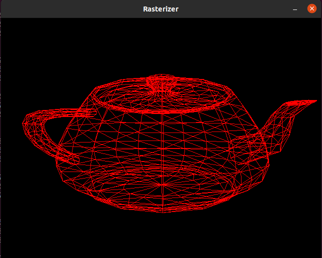
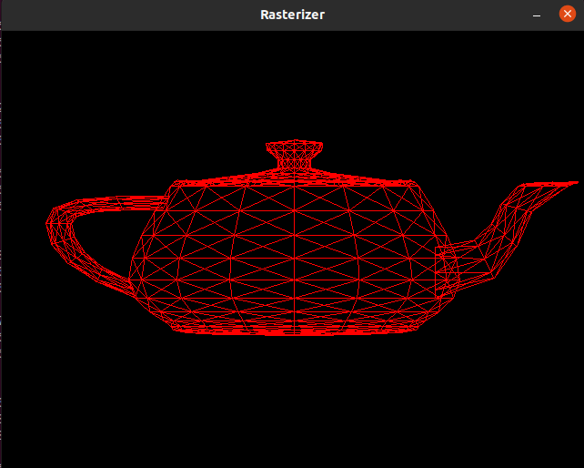
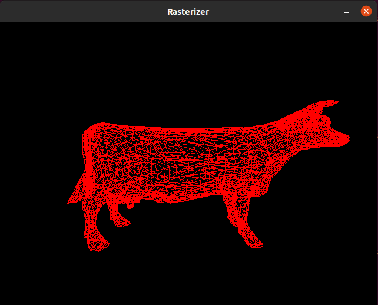
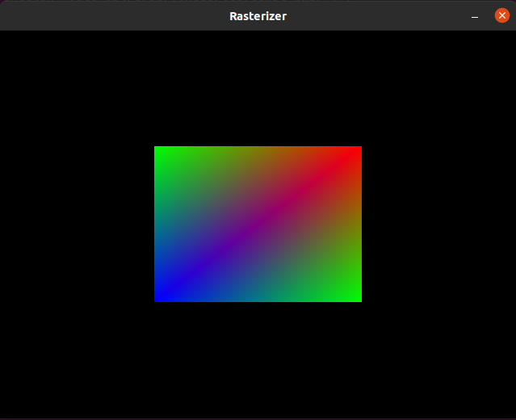

# rasterizer
Implementation of a software rasterizer

 

### Controls:

1. `UP Arrow`: Scale up

2. `Down Arrow`:Scale down

3. `Left Arrow`: Rotate around y clock-wise

4. `Right Arrow`: Rotate around y Counter-clock-wise

5. `w`: toggle between wireFrame / surface shading 

6. `s`: toggle between Blinn-Phong / Gooch shading

7. `ESc`: Quit

### TO-DO:

1. ~~Z-buffer~~ (DONE)

2. Clipping

3. Textures

4. ~~Shading~~ (DONE)
